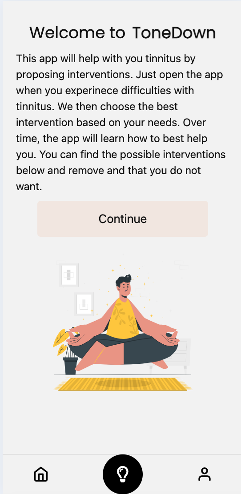
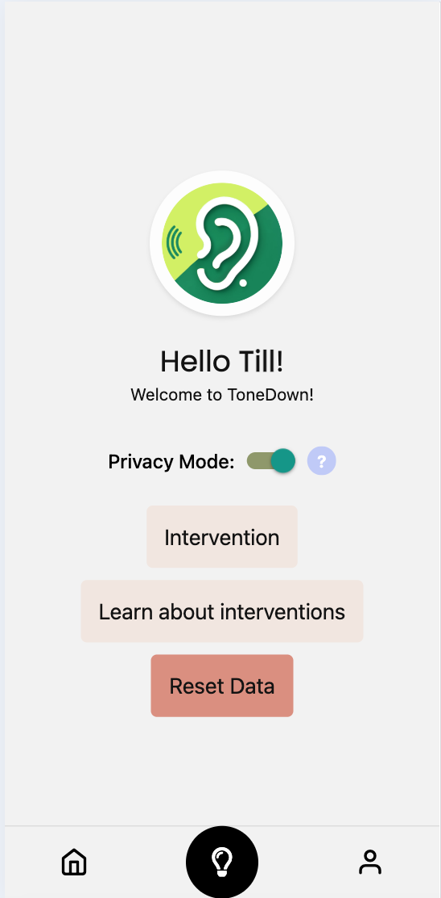
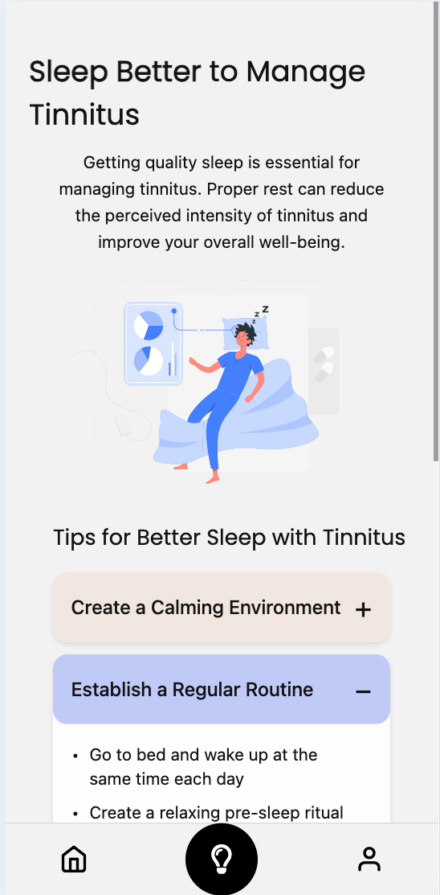
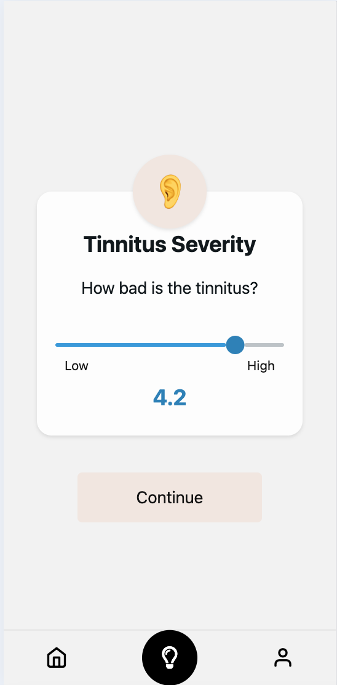
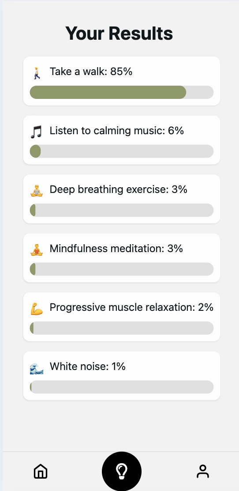
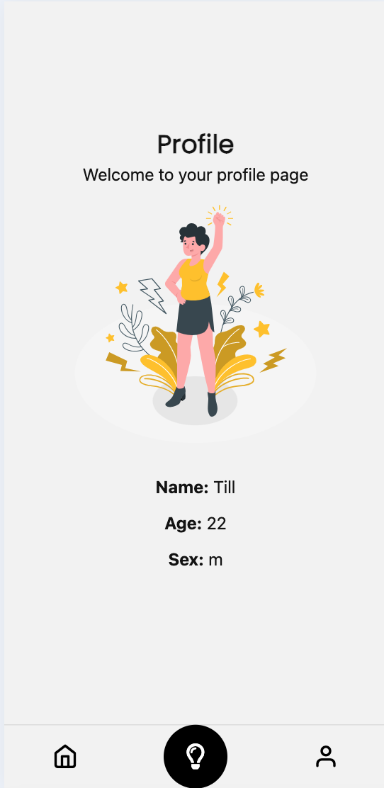

# ToneDown: Personalized Tinnitus Intervention App

ToneDown is a mobile application designed to help individuals manage tinnitus through personalized interventions. By leveraging advanced statistical modeling, the app learns from user feedback to provide increasingly effective recommendations over time.

[](https://www.youtube.com/watch?v=YOUTUBE_VIDEO_ID)

## Project Overview

ToneDown consists of three main components:
- **React Native Frontend**: A cross-platform mobile application built with Expo.
- **Flask Backend**: A Python-based API server for data processing and analysis.
- **Statistical Modeling**: Bayesian hierarchical models for personalized intervention recommendations.

## Quick Start

### Prerequisites
- Node.js (v16+)
- Python 3.12
- Conda or Micromamba (recommended for environment management)

### Frontend Setup
```bash
# Run the setup script to install nvm and Node.js LTS
./setup.sh

# Navigate to the ToneDown directory
cd ToneDown

# Install dependencies
npm install

# Start the Expo development server
npx expo start
```

### Backend Setup
<details>
<summary>Click to expand backend setup instructions</summary>

```bash
# Create and activate a conda environment
conda env create -f hack_hpi_frontend/flask_backend/environment.yml
conda activate hack_hpi

# Or with micromamba
micromamba env create -f hack_hpi_frontend/flask_backend/environment.yml
micromamba activate hack_hpi

# Install additional requirements
pip install -r hack_hpi_frontend/flask_backend/requirements.txt

# Start the Flask server
cd hack_hpi_frontend/flask_backend
python app.py
```
</details>

> [!IMPORTANT]  
> Both the frontend and backend must be running simultaneously for the app to function properly.

### CmdStan Setup (for Statistical Modeling)
<details>
<summary>Click to expand statistical modeling setup</summary>

```bash
# Install build tools if needed
sudo apt-get update
sudo apt-get install -y build-essential make g++

# Install CmdStan
python -m cmdstanpy.install_cmdstan --cores 1 --verbose
```
</details>

> [!CAUTION]  
> The statistical modeling component requires significant computational resources. Ensure your system meets the minimum requirements before proceeding.

## Project Components

### 1. React Native Frontend

The frontend provides a seamless cross-platform mobile experience for tinnitus management.

<details>
<summary>Key Features</summary>

- **User Profiles**: Personalized experience with user data storage.
- **Tinnitus Assessment**: Questionnaires to evaluate tinnitus severity and characteristics.
- **Intervention Recommendations**: Display of personalized intervention suggestions.
- **Feedback Collection**: Gathering user feedback on intervention effectiveness.
- **Privacy Controls**: Options for users to control data sharing.
</details>

<details>
<summary>Key Technologies</summary>

- React Native with Expo.
- Expo Router for navigation.
- AsyncStorage for local data persistence.
- Expo Secure Store for sensitive data.
</details>

### 2. Flask Backend

The Flask backend serves as the API layer between the frontend and the statistical models.

<details>
<summary>Key Features</summary>

- **Data Processing**: Cleaning and preparing user data for analysis.
- **API Endpoints**: RESTful endpoints for data submission and retrieval.
- **Integration**: Connecting the frontend with the statistical models.
- **Data Storage**: Managing user data and intervention history.
</details>

<details>
<summary>Key Technologies</summary>

- Flask web framework.
- Flask-CORS for cross-origin resource sharing.
- Pandas for data manipulation.
- JSON for data exchange.
</details>

### 3. Statistical Modeling

The statistical component uses Bayesian hierarchical models to provide personalized intervention recommendations.

<details>
<summary>Key Features</summary>

- **Single-User Sampling**: Analyzing individual user data to determine effective interventions.
- **Hierarchical Sampling**: Learning across users to improve recommendations.
- **Posterior Probability Calculation**: Determining the most likely effective interventions.
- **Adaptive Learning**: Improving recommendations over time based on feedback.
</details>

<details>
<summary>Key Technologies</summary>

- CmdStan for Bayesian inference.
- Stan modeling language.
- Python wrappers for model integration.
- Pandas for data handling.
</details>

## App Gallery

<table>
  <tr>
    <td><br>Welcome Screen</td>
    <td><br>Home Screen</td>
    <td><br>Sleep Info</td>
  </tr>
  <tr>
    <td><br>Tinnitus Assessment</td>
    <td><br>Results</td>
    <td><br>Profile</td>
  </tr>
</table>

## Project Structure

```
hack_hpi_frontend/
├── ToneDown/                  # React Native Frontend
│   ├── app/                   # Expo Router app directory
│   ├── assets/                # Images and other static assets
│   ├── components/            # Reusable React components
│   └── package.json           # Frontend dependencies
├── flask_backend/             # Flask Backend
│   ├── app.py                 # Main Flask application
│   ├── environment.yml        # Conda environment specification
│   └── requirements.txt       # Python dependencies
└── backend/                   # Statistical Modeling
    ├── backend_wrapper.py     # Interface to statistical models
    ├── single_user_sampler.py # Single-user analysis
    ├── hierarchical_sampler.py# Hierarchical modeling
    └── hier_reg.stan          # Stan model definition
```

## About This Project

This application was developed during the HPI Hackathon 2025 by a team of master's students in computer science. The project integrates mobile development with statistical modeling to create a practical healthcare application.

## Contributors

- [Belena Zwadsich](https://github.com/BelanaZ)
- [Till Zemann](https://github.com/till2)
- [Yuvraj Dhepe](https://github.com/Yuvraj-Dhepe)
- [Fynn Kroeger](https://github.com/fynnkroeger)
- [Lasse Meixner](https://github.com/lasse-meixner)
- [Isabel Kurth](https://github.com/IsabelKurth)

## License

This project is licensed under the MIT License - see the LICENSE file for details.

> [!NOTE]  
> For any questions or issues, please open an issue in this repository.

